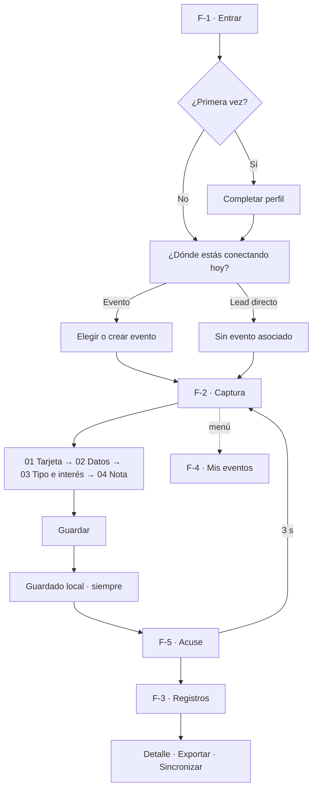

# 01 · Especificación funcional — Foloo Basic

> Este documento define **qué** debe lograr Foloo Basic y **por qué**. El **cómo** lo decide el desarrollador.
> Cuando un requerimiento fija una restricción técnica es porque el negocio no puede absorber la alternativa, y así se explica en cada caso.

---

## 1. Objetivo de negocio

Que ningún lead de un evento se pierda en una bolsa de tarjetas, y que cada persona reciba contacto el mismo día.

| Indicador | Hoy | Meta Basic |
|---|---|---|
| Tarjetas que llegan a marketing | ~40% | 100% |
| Tiempo del evento a la hoja de cálculo | 1–2 semanas | **el mismo día** |
| Tiempo de registro por lead | ~3 min (a mano, después) | **< 60 segundos, en el piso** |

Posicionamiento: Foloo **no es un escáner de tarjetas**. Su trabajo es todo lo que pasa entre "conocí a alguien" y "ese lead está registrado, con contexto, y disponible para el equipo". El modelo mental es **Meet → Capture → Context → Foloo**.

### 1.1 Dónde termina Basic

**Basic resuelve la captura. No envía correos.** Por decisión de los solicitantes, el envío automático de correos al lead y a marketing queda fuera de esta versión.

Eso parte la promesa del producto en dos, y conviene tenerlo explícito porque cambia cómo se mide el éxito:

| | Promesa | Cómo se cumple |
|---|---|---|
| **Basic** | Que ningún lead se pierda en una bolsa de tarjetas | Todo lead capturado llega a la hoja de cálculo el mismo día |
| **Pro** | Que cada lead reciba contacto el mismo día | El correo de seguimiento sale solo, con la información adjunta |

El seguimiento en Basic lo hace una persona, a mano, desde la hoja de cálculo. La app garantiza que el dato esté ahí completo, a tiempo y sin perderse; no garantiza que alguien lo use.

---

## 2. Alcance de la versión Basic

### 2.1 Dentro

| Área | Qué entra |
|---|---|
| Acceso | Login con usuario y contraseña · perfil del vendedor (nombre, empresa, foto) · cerrar sesión |
| Eventos | Crear, listar, editar, eliminar · evento activo · contadores de leads y pendientes |
| Origen | Captura **con evento** o como **lead directo** (sin evento) |
| Captura | Foto de tarjeta con lectura automática · datos editables · tipo de lead · nivel de interés · nota de voz · nota escrita |
| Persistencia | Guardado local primero · cola de pendientes · sincronización automática y manual · sin duplicados |
| Salida | Escritura en hoja de cálculo por evento |
| Consulta | Lista de registros con búsqueda y filtros · detalle de la conexión en solo lectura · reproducción de la nota de voz |
| Exportación | XLS y CSV, a elección del usuario |
| Apariencia | Tema claro y tema oscuro |
| Distribución | Interna al equipo comercial (TestFlight / APK firmado) |

### 2.2 Fuera — backlog explícito

Estas cosas **no se diseñan ni se insinúan** en Basic. Si el agente encuentra un hueco que "se resolvería fácil" con alguna de ellas, la respuesta es no.

| Fuera de Basic | Nota |
|---|---|
| **Correos automáticos al lead y a marketing** | Decisión de los solicitantes. Es un cambio de alcance respecto de la v1.0 del PDF, donde eran *Debe* (`RF-27` … `RF-32`). Entran en Pro. Ver `D-13`. |
| **Editor de plantillas de correo** | Sin envío no hay plantilla que editar. |
| **Transcripción de la nota de voz** | Grabar y reproducir sí. Transcribir automáticamente **no**. Es un cambio de alcance respecto de la v1.0 del PDF — ver `D-01`. |
| Escaneo de códigos QR de gafetes | — |
| Integración directa a CRM (HubSpot / Salesforce) | El modelo de datos debe permitirlo después sin migración. Ver `D-07`. |
| Panel de métricas por evento o por vendedor | — |
| Roles, permisos y equipos | Hay login, pero un solo tipo de usuario. |
| Dashboard web / biblioteca de documentos | Existe en la visión del producto, no en Basic. |
| Puntuación de leads con IA, resúmenes de conversación con IA | — |
| Publicación en App Store y Play Store | — |
| Planes de pago y cobro | El menú muestra la insignia "Basic" como etiqueta estática. No hay lógica de plan. |

---

## 3. Actores y entidades

### 3.1 Actores

| Actor | Descripción |
|---|---|
| **Vendedor** | Único usuario de la app. Captura de pie, en el evento. No configura servidores, no elige integraciones, no administra a nadie. |
| **Marketing** | No usa la app. Consume la hoja de cálculo y hace el seguimiento a mano. |
| **Lead** | Persona cuya tarjeta se captura. No usa la app y **no recibe nada de ella**. El seguimiento lo hace una persona desde la hoja. |
| **Backend Foloo** | Servicio propio. Único que habla con proveedores externos (visión, hoja de cálculo, almacenamiento). |

### 3.2 Modelo de datos

#### Usuario

| Campo | Tipo | Obligatorio | Origen |
|---|---|---|---|
| `id` | texto | sí | servidor |
| `usuario` | texto | sí | login |
| `nombre` | texto | sí | perfil |
| `empresa` | texto | sí | perfil |
| `fotoUrl` | enlace | no | perfil |
| `plan` | texto | sí | servidor (`basic`) |

#### Evento

| Campo | Tipo | Obligatorio | Origen |
|---|---|---|---|
| `id` | texto | sí | generado |
| `codigo` | texto | sí | generado — 3 letras + `AAMMDD` (ej. `EXP-260812`) |
| `nombre` | texto | sí | usuario |
| `fechaInicio` | fecha | sí | usuario |
| `fechaFin` | fecha | sí | usuario |
| `activo` | booleano | sí | sistema — exactamente uno activo a la vez |
| `hojaUrl` | enlace | no | servidor |
| `eliminado` | booleano | sí | sistema — baja lógica, nunca física |

#### Lead

Este es el orden de columnas esperado en la hoja de cálculo.

| Campo | Tipo | Obligatorio | Origen |
|---|---|---|---|
| `folio` | texto | sí | generado |
| `fecha` | fecha y hora ISO 8601 | sí | automático |
| `origen` | `evento` \| `directo` | sí | selección |
| `evento` | texto | sí si `origen = evento` | evento activo |
| `capturadoPor` | texto | sí | perfil |
| `nombre` | texto | sí | lectura o manual |
| `apellido` | texto | no | lectura o manual |
| `puesto` | texto | no | lectura o manual |
| `empresa` | texto | sí | lectura o manual |
| `correo` | correo | sí, **o** teléfono | lectura o manual |
| `telefono` | texto | sí, **o** correo | lectura o manual |
| `tipo` | `Cliente` \| `Partner` \| `Proveedor` | sí | selección |
| `interes` | `Alto` \| `Medio` \| `Bajo` | sí | selección |
| `nota` | texto largo | no | escrita |
| `audioSegundos` | número | no | automático |
| `audioUrl` | enlace | no | subida |
| `tarjetaUrl` | enlace | no | subida |
| `estadoSync` | `local` \| `pendiente` \| `enHoja` | sí | sistema |

**Reglas de validación**
- `nombre` y `empresa` son obligatorios.
- Se exige al menos uno entre `correo` y `telefono`.
- `tipo` es obligatorio; **no tiene valor por defecto**.
- `interes` tiene valor por defecto `Medio`.
- `correo` se valida con formato antes de guardar. Aunque Basic no envíe correos, un correo mal leído es un lead perdido en silencio en cuanto alguien intente el seguimiento a mano.

**Compatibilidad con Pro.** Pro agrega cinco columnas a este modelo (`lugar`, `transcripcion`, `adjuntos`, `estadoCorreoLead`, `estadoCorreoMarketing`). Deben **añadirse al final** del orden de columnas, nunca intercalarse, para que activar Pro sobre una hoja existente no obligue a migrar las filas ya escritas.

**Formato de folio:** `{PREFIJO}-{AAMMDD}-{NNN}`
- `PREFIJO` = las 3 primeras letras del código del evento (ej. `EXP-260812-001`).
- Para lead directo, `PREFIJO` = `FOL` (ej. `FOL-260812-014`).
- `NNN` = consecutivo de 3 dígitos por evento y por día.
- El folio es **legible por humanos** y es la llave de idempotencia del sistema.

---

## 4. Flujos principales



### F-1 · Entrar y preparar

Ocurre una vez al inicio de la jornada. **Nunca por lead.**

1. Login con usuario y contraseña. El workspace se detecta solo: el vendedor no elige servidor ni instancia.
2. Solo la primera vez: **Tu perfil** — nombre completo, empresa y foto. Es lo que verá el lead en el seguimiento.
3. **¿Dónde estás conectando hoy?** — se elige entre `Evento` y `Lead directo`.
   - Sin eventos previos: en lugar de una lista vacía, aparece el formulario para nombrar el evento y sus fechas. Se escribe y se empieza.
   - Con eventos previos: lista con el último activo preseleccionado, más "Crear evento nuevo".
   - Lead directo: una sola frase explicando que se guarda sin evento, y el botón para entrar directo a captura.

### F-2 · Capturar una conexión

**Una sola pantalla con scroll, no un asistente.** Nadie quiere avanzar y volver con una tarjeta en la mano. Barra de progreso fija arriba ("Paso 2 de 4" + título del paso), botón "Guardar" fijo abajo.

| Paso | Nombre | Contenido |
|---|---|---|
| 00 | Origen del lead | Segmentado `Evento` / `Lead directo` + selector del evento activo + botón `+` para crear uno |
| 01 | La tarjeta | Cámara o galería · preview · botón "Reprocesar" (solo si ya hay foto) |
| 02 | Datos del lead | Nombre · Apellido · Puesto · Empresa · Correo · Teléfono — todos editables |
| 03 | Tipo de lead | `Proveedor` / `Partner` / `Cliente` + nivel de interés en semáforo `Bajo` / `Medio` / `Alto` |
| 04 | Nota de la plática | Grabadora con onda viva y temporizador · nota escrita opcional |

El paso 01 alimenta al 02: el resultado de la lectura se muestra **ya aplicado y revisable** en los campos, no como un bloque de texto aparte.

### F-3 · Revisar, exportar, sincronizar

Desde el menú → **Registros**. Lista de leads del evento seleccionado con búsqueda, filtros por tipo, indicador de estado por renglón y riel de color que repite el nivel de interés. Desde ahí se abre el **detalle de la conexión** (solo lectura), se **exporta** (XLS o CSV) y se **sincroniza** manualmente.

### F-4 · Administrar eventos

Desde el menú → **Mis eventos**. Lista completa con el activo marcado, contadores y papelera por renglón. Se crea, se edita y se elimina. Eliminar un evento **no toca la hoja de cálculo**.

### F-5 · Salida de datos

Al guardar: guardado local → cola → backend → fila en la hoja del evento, más la subida del audio y de la foto. Todo lo que falle se reintenta; nada de eso bloquea al vendedor.

**No se envía ningún correo.** Ni al lead, ni a marketing. El seguimiento arranca cuando una persona abre la hoja.

---

## 5. Inventario de pantallas

16 pantallas, 390×844, vertical.

| ID | Pantalla | Propósito |
|---|---|---|
| `P-01` | Login | Usuario y contraseña. Pie con versión y empresa. |
| `P-02` | Tu perfil | Solo la primera vez. Foto, nombre completo, empresa. |
| `P-03` | ¿Dónde conectas? · primer uso | Sin eventos: nombre y fechas listos para escribir. |
| `P-04` | ¿Dónde conectas? · con eventos | Lista con el activo preseleccionado + crear nuevo. |
| `P-05` | ¿Dónde conectas? · lead directo | Una frase y el botón "Capturar conexión". |
| `P-06` | Crear evento (diálogo) | Sale sobre Mis eventos. Nombre, fechas, Cancelar / Crear. |
| `P-07` | Captura · pasos 01–02 | Home. Origen, tarjeta y datos. |
| `P-08` | Captura · tarjeta lista | Mismo paso 01 con preview ocupado y "Reprocesar". |
| `P-09` | Captura · pasos 03–04 | Tipo con sello, interés en semáforo, grabadora con onda viva. |
| `P-10` | Acuse · lead guardado | El único momento expresivo. Regresa sola a captura en 3 s. |
| `P-11` | Menú lateral | Entra desde la derecha. Perfil, navegación, apariencia, cerrar sesión. |
| `P-12` | Registros | Lista, búsqueda, filtros, banner de pendientes, dock con Exportar y Sincronizar. |
| `P-13` | Exportar (diálogo) | XLS (por defecto) o CSV, con el conteo exacto de lo que se baja. |
| `P-14` | Detalle de la conexión | Solo lectura. Contacto, notas, reproductor de voz y datos del registro. |
| `P-15` | Mis eventos | Lista con activo marcado, contadores, papelera por renglón, crear evento. |
| `P-16` | Editar evento | Nombre, fechas, estadísticas y eliminar — fuera del dock. |

---

## 6. Requerimientos funcionales

### 6.1 Acceso, perfil y sesión

| ID | Requerimiento | Prioridad | Traza v1.0 |
|---|---|---|---|
| `AUT-01` | Iniciar sesión con usuario y contraseña. El workspace se resuelve del lado del servidor: el vendedor no elige servidor, instancia ni evento en esta pantalla. | Debe | nuevo |
| `AUT-02` | La sesión persiste al cerrar y reabrir la app. Reabrir no debe volver a pedir contraseña mientras la sesión sea válida. | Debe | RF-34 |
| `AUT-03` | Mostrar la contraseña con un toque, para poder verificar lo escrito de pie y con prisa. | Debería | nuevo |
| `AUT-04` | Tras el primer login, pedir el perfil una sola vez: nombre completo, empresa y foto (cámara o galería). La foto es opcional; nombre y empresa no. | Debe | RF-33 |
| `AUT-05` | El perfil se guarda en el dispositivo y viaja en cada lead como `capturadoPor`, para que la hoja diga siempre quién capturó. | Debe | RF-11 |
| `AUT-06` | El perfil se puede volver a editar desde el menú. | Debería | nuevo |
| `AUT-07` | "Cerrar sesión" vive al fondo del menú, con su propio contorno, fuera del alcance cómodo del pulgar, para que no se toque por accidente. | Debe | nuevo |
| `AUT-08` | Al cerrar sesión, los leads **pendientes de subir no se borran**. Al volver a entrar el mismo usuario, siguen en cola. | Debe | Art. 2 |
| `AUT-09` | Mostrar en el pie del login y del menú la versión de la app y la empresa (ej. `Foloo v1.0.4 · CBQA Solutions`). | Debería | nuevo |

### 6.2 Eventos

| ID | Requerimiento | Prioridad | Traza v1.0 |
|---|---|---|---|
| `EVT-01` | Crear un evento con nombre, fecha de inicio y fecha de fin. Las tres son obligatorias. | Debe | RF-33 |
| `EVT-02` | Al crear un evento, queda **activo** y los leads que se capturen se guardan ahí. Exactamente un evento activo a la vez. | Debe | nuevo |
| `EVT-03` | En el primer uso, cuando no hay eventos, no se muestra una lista vacía: se muestra el formulario de creación ya listo, con el texto "Aún no tienes eventos. Este será el primero y queda activo." | Debe | Art. 8 |
| `EVT-04` | Al volver a entrar, la pantalla de origen muestra los eventos existentes con el último activo preseleccionado, cada uno con su fecha y su conteo de leads. | Debe | nuevo |
| `EVT-05` | Se puede crear un evento desde tres lugares: la pantalla de origen, el botón `+` junto al selector en captura, y el dock de Mis eventos. El diálogo es el mismo en los tres. | Debe | nuevo |
| `EVT-06` | "Mis eventos" lista todos los eventos con nombre, fecha, total de leads y cuántos están por subir. El activo lleva la insignia "Activo". | Debe | nuevo |
| `EVT-07` | Editar un evento permite cambiar nombre y fechas, y muestra sus estadísticas (leads totales y por subir). | Debe | nuevo |
| `EVT-08` | Eliminar un evento es una **baja lógica**: sus leads dejan de aparecer en la app, **la hoja de cálculo no se toca**. Ese texto debe estar visible junto a la acción, antes de ejecutarla. | Debe | Art. 2 |
| `EVT-09` | La acción de eliminar vive fuera del dock inferior, con contorno propio, y pide confirmación. | Debe | Art. 7 |
| `EVT-10` | No se puede eliminar un evento con leads pendientes de subir sin advertirlo explícitamente. | Debería | Art. 2 |
| `EVT-11` | El encabezado del menú y el pie muestran el evento activo con su código (ej. `EXP-260812 · Expo Alimentaria`). | Debería | nuevo |

### 6.3 Origen del lead

| ID | Requerimiento | Prioridad | Traza v1.0 |
|---|---|---|---|
| `CAP-01` | El origen se elige entre `Evento` y `Lead directo` con un control segmentado de dos opciones, visible en la parte alta de la pantalla de captura. | Debe | nuevo |
| `CAP-02` | Con origen `Evento`, se muestra el selector del evento activo, su fecha y un botón `+` para crear uno nuevo sin salir de captura. | Debe | nuevo |
| `CAP-03` | Con origen `Lead directo`, el lead se guarda sin evento asociado, en la base general. La app lo dice con una frase: "Se guarda sin evento, en tu base general de leads." | Debe | nuevo |
| `CAP-04` | El origen elegido **persiste entre capturas consecutivas**. Quien está en una expo no lo cambia 40 veces. | Debe | Art. 1 |

### 6.4 Captura — paso 01: la tarjeta

| ID | Requerimiento | Prioridad | Traza v1.0 |
|---|---|---|---|
| `OCR-01` | Abrir la cámara trasera directamente desde la app, y también permitir elegir una foto de la galería. Dos botones separados, ambos ≥48 dp. | Debe | RF-01 |
| `OCR-02` | Redimensionar la imagen en el cliente a 1568 px de lado largo y comprimir a JPEG antes de enviarla, para no consumir datos del celular. | Debe | RF-02 |
| `OCR-03` | Extraer y precargar: nombre, apellido, empresa, correo, teléfono. Adicionales: puesto. | Debe | RF-03 |
| `OCR-04` | Leer correctamente tarjetas giradas 90° o 180°, con sombra o fondo desordenado. Caso de prueba real: tarjeta vertical sostenida en la mano. | Debe | RF-04 |
| `OCR-05` | Todos los campos leídos quedan editables. **La lectura nunca sobrescribe algo que el usuario ya corrigió a mano.** | Debe | RF-05 |
| `OCR-06` | Si la lectura falla, mostrar el motivo y permitir continuar con captura manual. La falla nunca bloquea el registro. Copy: "Tarjeta ilegible. Escribe los datos a mano." | Debe | RF-06 |
| `OCR-07` | Mientras no hay foto, el renglón dice "Sin foto aún". Con foto, dice "Tarjeta lista · datos aplicados" y aparece el botón "Reprocesar". **Sin foto ese botón no existe.** | Debe | nuevo |
| `OCR-08` | Conservar la foto original de la tarjeta y guardar su enlace junto al registro. | Debería | RF-07 |
| `OCR-09` | Se puede quitar o reemplazar la foto antes de guardar. | Debe | nuevo |

**Sobre la tecnología de lectura.** `OCR-04` es el requerimiento que decide el proveedor. El OCR clásico (Tesseract y similares) devuelve texto suelto sobre una tarjeta girada y con sombra, y obliga a mantener reglas frágiles para adivinar qué línea es la empresa y cuál el puesto. Un modelo de visión con lenguaje devuelve los campos **ya clasificados**. Cualquier proveedor es aceptable (modelo multimodal, Google Cloud Vision con capa de clasificación, AWS Textract) siempre que cumpla `OCR-04` en la prueba de aceptación.

**Restricción de arquitectura (Artículo 3).** La llamada al proveedor va del lado del servidor, **nunca desde la app**. La app envía la imagen a un endpoint propio, por ejemplo `POST /api/leer-tarjeta`, y recibe el JSON.

Contrato de respuesta esperado:

```json
{ "nombre": "", "apellido": "", "puesto": "", "empresa": "", "correo": "", "telefono": "" }
```

Cadena vacía cuando el dato no aparece en la tarjeta. **Nunca valores inventados.**

### 6.5 Captura — paso 02: datos del lead

| ID | Requerimiento | Prioridad | Traza v1.0 |
|---|---|---|---|
| `CAP-05` | Campos: Nombre y Apellido en la misma fila; después Puesto, Empresa, Correo y Teléfono, uno por renglón. | Debe | RF-03 |
| `CAP-06` | Teclados correctos por campo: correo con teclado de correo y sin autocapitalización; teléfono con teclado numérico. | Debe | Art. 1 |
| `CAP-07` | Cifras tabulares en teléfono y en toda columna de datos, para que los números se alineen. | Debería | DS |
| `CAP-08` | Validar formato de correo antes de guardar. Un correo inválido bloquea el guardado y señala el campo con icono y texto, nunca solo con color. | Debe | v1.0 §5 |

### 6.6 Captura — paso 03: tipo de lead e interés

| ID | Requerimiento | Prioridad | Traza v1.0 |
|---|---|---|---|
| `CAP-09` | Elección obligatoria entre **tres** tipos: `Proveedor`, `Partner`, `Cliente`. Tres controles grandes en fila, con icono y palabra, sin menú desplegable. Sin valor por defecto. | Debe | RF-08 (ampliado) |
| `CAP-10` | La selección se comunica con relleno de tinte lima, borde de 2 px `#1F1F1F` y una marca de verificación. Nunca solo con color. | Debe | Art. 5 |
| `CAP-11` | Nivel de interés en semáforo de tres posiciones: `Bajo`, `Medio`, `Alto`. Valor por defecto `Medio`. | Debe | RF-09 |
| `CAP-12` | El nivel de interés se refleja después como riel de color en la lista de registros, para poder priorizar el seguimiento de un vistazo. | Debe | nuevo |

### 6.7 Captura — paso 04: nota de la plática

| ID | Requerimiento | Prioridad | Traza v1.0 |
|---|---|---|---|
| `VOZ-01` | Grabar audio con un toque y detener con otro, con temporizador `mm:ss` e indicador visual inequívoco de que el micrófono está activo (onda viva + etiqueta "Grabando"). | Debe | RF-13 |
| `VOZ-02` | Permitir reproducir, borrar y volver a grabar antes de guardar. | Debe | RF-15 |
| `VOZ-03` | Subir el audio y guardar su enlace junto al registro. La subida es asíncrona y **no bloquea el guardado**. | Debe | RF-16 |
| `VOZ-04` | Mientras no haya conexión, el audio se guarda en el teléfono. Copy visible: "Se guarda en tu teléfono. Se sube cuando haya señal." | Debe | Art. 4 |
| `VOZ-05` | Nota escrita opcional, siempre disponible, independiente de la nota de voz. Un lead se puede terminar solo con nota escrita, solo con voz, o sin ninguna. | Debe | RF-17 |
| `VOZ-06` | Si el permiso de micrófono está denegado, el paso 04 no se bloquea: se explica y se deja la nota escrita. | Debe | Art. 1 |
| `VOZ-07` | **La transcripción automática NO entra en Basic.** No se implementa, no se insinúa en la UI, no se deja un campo esperándola. Ver `D-01`. | Debe | — |

### 6.8 Guardado y acuse

| ID | Requerimiento | Prioridad | Traza v1.0 |
|---|---|---|---|
| `CAP-13` | La acción principal "Guardar" vive en un dock fijo inferior de 56 dp, presente en toda la pantalla de captura sin importar el scroll. | Debe | RNF-04 |
| `CAP-14` | La barra de progreso superior muestra el paso actual con título y "Paso N de 4", y avanza conforme se completan los pasos. | Debe | nuevo |
| `CAP-15` | Al guardar, el registro se escribe **en el dispositivo antes** de intentar cualquier envío por red. | Debe | RF-18 |
| `CAP-16` | Si la validación falla, se señalan los campos faltantes y se desplaza al primero, sin perder nada de lo capturado. | Debe | Art. 2 |
| `CAP-17` | El acuse muestra: nombre y empresa del lead, folio, y la confirmación de lo que efectivamente ocurrió, con su hora. Con conexión: la fila en la hoja del evento. Sin conexión: guardado en el teléfono. Es el único momento expresivo del sistema. Ver `D-06`. | Debe | RF-12 |
| `CAP-18` | El acuse regresa **solo** a captura a los 3 segundos, con cuenta regresiva visible, y ofrece "Capturar otro ahora" para no esperar. | Debe | Art. 1 |
| `CAP-19` | Al volver a captura, el formulario queda limpio pero **conserva el origen y el evento activo**. | Debe | `CAP-04` |

### 6.9 Persistencia y sincronización

| ID | Requerimiento | Prioridad | Traza v1.0 |
|---|---|---|---|
| `SYN-01` | Todo lo capturado vive primero en el dispositivo. La app funciona completa sin conexión salvo la lectura de tarjeta, que se degrada a captura manual. | Debe | RF-18, RNF-02 |
| `SYN-02` | Sin conexión, el registro se encola y se marca como pendiente de forma visible, en la lista y en el detalle. | Debe | RF-19 |
| `SYN-03` | Reintentar la sincronización automáticamente al recuperar conexión, y también con un botón manual en el dock de Registros. | Debe | RF-20 |
| `SYN-04` | Evitar duplicados con el **folio como llave de idempotencia**. Reenviar el mismo folio no crea una segunda fila. | Debe | RF-21 |
| `SYN-05` | El estado de conexión se muestra en el encabezado con icono `wifi-off`, la palabra "Sin conexión" y color gris. Nunca en rojo. | Debe | Art. 4 |
| `SYN-06` | El banner de pendientes dice exactamente cuántos son: "2 registros esperan señal". | Debe | Art. 8 |
| `SYN-07` | La sincronización es reanudable: si se corta a la mitad, los ya subidos no se reenvían. | Debe | `SYN-04` |
| `SYN-08` | Si un lead falla al sincronizar repetidamente, se marca como fallido con motivo legible y opción de reintentar; nunca se descarta en silencio. | Debería | Art. 2 |

### 6.10 Salida de datos: la hoja de cálculo

> **Basic no envía correos.** Los requerimientos de correo (`SAL-05` … `SAL-10`) viven en `05-especificacion-pro.md`. No se implementan aquí, no se dejan a medias, y no se deja UI esperándolos.

| ID | Requerimiento | Prioridad | Traza v1.0 |
|---|---|---|---|
| `SAL-01` | Escribir una fila por lead en la hoja de cálculo del evento, con encabezados fijos en el orden de la sección 3.2. | Debe | RF-24 |
| `SAL-02` | Crear la hoja y los encabezados en la primera ejecución si no existen. | Debería | RF-25 |
| `SAL-03` | El audio y la foto se guardan en almacenamiento de archivos; en la hoja va el **enlace**, no el archivo. | Debe | RF-26 |
| `SAL-04` | **La escritura en la hoja la ejecuta el servidor, no la app.** La app entrega el registro a su backend, que se encarga de la hoja y de los archivos. | Debe | Art. 3 |
| `SAL-11` | La hoja es el único canal de salida de Basic, así que tiene que estar completa: si un campo llega vacío que sea porque el lead no lo tenía, nunca porque la app lo perdió en el camino. | Debe | Art. 2 |
| `SAL-12` | El orden de columnas de la sección 3.2 es contrato. Pro agrega columnas **al final**; nada se intercala ni se reordena. | Debe | nuevo |

**Por qué la hoja carga con todo el peso.** En Basic, la fila de la hoja es lo único que sale del teléfono hacia el negocio. No hay un correo que sirva de respaldo ni de aviso. Si la fila queda incompleta, el lead está perdido aunque la app diga que se guardó.

### 6.11 Registros, detalle y exportación

| ID | Requerimiento | Prioridad | Traza v1.0 |
|---|---|---|---|
| `REG-01` | Lista de registros del evento seleccionado, con encabezado que muestra el nombre del evento y el conteo: "6 leads · 2 por subir". | Debe | RF-22 |
| `REG-02` | Selector de evento en el encabezado de Registros, para consultar eventos anteriores sin cambiar el evento activo de captura. | Debe | nuevo |
| `REG-03` | Búsqueda por nombre o empresa, con filtrado en vivo. Funciona sin conexión sobre los datos locales. | Debe | nuevo |
| `REG-04` | Filtros por tipo: `Todos`, `Clientes`, `Partners`, `Proveedores`. | Debe | nuevo |
| `REG-05` | Cada renglón muestra: riel de color del nivel de interés, nombre, empresa · tipo, botón de reproducción si hay nota de voz, e indicador de estado (`Por subir` / `En la hoja`) con icono y etiqueta accesible. | Debe | RF-22 |
| `REG-06` | Tocar un renglón abre el **detalle de la conexión**, en solo lectura: chips de tipo, interés y estado; foto de la tarjeta o el estado "Sin foto de la tarjeta"; contacto (correo, teléfono, puesto); nota de voz con reproductor y duración; nota escrita; y bloque de registro con fecha y hora, origen y quién capturó. El folio no se muestra por ahora. | Debe | nuevo |
| `REG-07` | El detalle **no edita**. Es una tarjeta de lectura. Ver `D-04`. | Debe | nuevo |
| `REG-08` | Estado vacío como invitación, no como callejón: "Aún no hay leads. Captura el primero y aparece aquí, con o sin conexión." | Debe | Art. 8 |
| `REG-09` | Exportar abre un diálogo con dos formatos: **XLS marcado por defecto** ("Hoja de Excel, listo para abrir") y **CSV** ("Texto plano, para otro sistema"). El diálogo dice exactamente qué se baja: "6 leads de Expo Alimentaria México, con notas y datos de contacto." | Debe | RF-23 |
| `REG-10` | El CSV se genera con **BOM UTF-8** para que Excel en español abra los acentos correctamente. | Debe | RF-23 |
| `REG-11` | La exportación funciona sin conexión sobre los datos locales, e incluye los leads pendientes de subir. | Debe | Art. 2 |
| `REG-12` | El archivo exportado se puede compartir con la hoja de compartir del sistema operativo. | Debe | RF-23 |

### 6.12 Navegación y apariencia

| ID | Requerimiento | Prioridad | Traza v1.0 |
|---|---|---|---|
| `NAV-01` | Menú lateral que entra desde la derecha con la hamburguesa del encabezado. Se cierra tocando el fondo (scrim `rgba(31,31,31,.40)`) o la `×`. | Debe | nuevo |
| `NAV-02` | El menú muestra el perfil del vendedor: iniciales o foto, nombre, insignia de plan y "empresa · área". | Debe | nuevo |
| `NAV-03` | Destinos del menú, con contador donde aplica: `Home` (marcado "AQUÍ" cuando corresponde), `Registros` (n), `Mis eventos` (n). | Debe | nuevo |
| `NAV-04` | Interruptor de apariencia claro / oscuro en el menú, con etiqueta explícita del modo. La preferencia persiste. | Debe | nuevo |
| `NAV-05` | El tema oscuro es un **remapeo de tokens**, no una hoja de estilos paralela. En oscuro, lima pasa a ser la superficie de acción primaria y las sombras se van a `none`. | Debe | Art. 6 |
| `NAV-06` | Pie del menú con evento activo y versión de la app. | Debería | nuevo |
| `NAV-07` | El botón físico o gesto de retroceso del sistema cierra el menú antes de navegar hacia atrás. | Debe | nuevo |

---

## 7. Requerimientos no funcionales

| ID | Requerimiento |
|---|---|
| `RNF-01` | La lectura de la tarjeta responde en **menos de 5 segundos** con red del recinto. Si tarda más, se muestra progreso y se puede seguir capturando a mano. |
| `RNF-02` | La app funciona completa sin conexión, salvo la lectura de tarjeta, que se degrada a captura manual. |
| `RNF-03` | Un mismo código base en iOS y Android (Flutter). Versiones mínimas: **iOS 15 y Android 10**, que cubren los equipos actuales del equipo comercial. |
| `RNF-04` | Diseñada para una mano: área táctil mínima **48 dp**, acción principal de **56 dp** fija en el tercio inferior, orientación vertical únicamente, acciones destructivas fuera de la zona del pulgar. |
| `RNF-05` | Accesible: objetivo **WCAG 2.2 AA** en ambos temas. Foco visible de 2 px lima con halo de 4 px al 12% de negro. Etiquetas en todos los campos y en todo control con solo icono. Respeta `prefers-reduced-motion`. |
| `RNF-06` | Las llaves de API viven solo en el servidor. **Ninguna credencial en el código del cliente.** Revisar el binario no debe revelar ninguna. |
| `RNF-07` | Los datos de leads viajan siempre por **HTTPS**. |
| `RNF-08` | Presupuesto de movimiento: 100 / 150 / 200 ms, techo duro **250 ms**, easing `cubic-bezier(.2,0,0,1)`. Sin cargadores decorativos, sin rebotes, sin splash animado. |
| `RNF-09` | Las tres tipografías se empacan como **assets locales**. La app tiene que verse bien en el primer arranque sin conexión. |
| `RNF-10` | *Reservado.* En la v1.0 este identificador cubría los límites del proveedor de correo; con el envío fuera de Basic, el requerimiento vive en `05-especificacion-pro.md` como `RNF-15`. No se reutiliza el número. |
| `RNF-11` | El arranque en frío hasta la pantalla de captura utilizable no debe superar **3 segundos** en el equipo más lento del parque. |
| `RNF-12` | La app debe soportar al menos **300 leads locales** por evento sin degradación visible de la lista ni de la búsqueda. |
| `RNF-13` | Todo estado de dato (online / offline / pendiente) tiene componente propio y consistente; no se repite marcado ad hoc por pantalla. |

---

## 8. Privacidad y cumplimiento

Se están capturando datos personales de terceros. Esto no es opcional y conviene resolverlo **antes del primer evento**, no después.

| ID | Requerimiento |
|---|---|
| `RC-01` | Cumplir la LFPDPPP mexicana. **Basic no tiene canal digital para entregar el aviso de privacidad**, porque no envía correos. La forma de cumplir con el aviso debe definirse con Legal antes del primer evento. Ver `D-14`. |
| `RC-02` | *Reservado.* En la v1.0 cubría la opción de baja en el correo al lead. Sin envío no aplica en Basic; vive en `05-especificacion-pro.md` como parte de `PLT-08`. Si Basic llegara a enviar algo alguna vez, este requerimiento revive tal cual. |
| `RC-03` | Definir con Legal o Dirección un periodo de retención para los audios y las fotos de tarjetas, y borrarlos al cumplirse. |
| `RC-04` | El acceso a la hoja y a la carpeta de audios se restringe al equipo de marketing y ventas. **Los enlaces de audio no deben quedar accesibles para cualquiera que tenga la URL**: se requiere acceso autenticado. |
| `RC-05` | Quien captura le avisa verbalmente al lead qué se va a hacer con sus datos y que alguien lo contactará. Es una regla de operación, pero en Basic **es el único vehículo del aviso**, así que sostiene `RC-01` por completo. |
| `RC-06` | La foto de la tarjeta y el audio se almacenan cifrados en reposo. |
| `RC-07` | Al eliminar un evento en la app, los datos personales asociados siguen sujetos a `RC-03`. La baja lógica en la app **no** es una eliminación de datos ante la ley. |

---

## 9. Sistema visual — resumen operativo

El detalle vive en `_ds/foloo-design-system/`. Esto es lo mínimo que no se puede violar:

| Aspecto | Regla |
|---|---|
| Color | Cuatro valores: `#FFFFFF`, `#1F1F1F`, `#C9FA00`, `#888888`. Todo lo demás derivado. Texto sobre lima siempre `#1F1F1F`. **Un solo elemento lima por pantalla.** En tema claro, la acción primaria es `#1F1F1F`; lima es acento, foco, selección y sincronizado. |
| Tipografía | Nexa Black/Heavy → títulos y números grandes. Poppins 500/600 → botones, etiquetas, chips (≤20 caracteres). DM Sans 400/500/700 → cuerpo, nombres, empresas, correos, notas, datos. Cifras tabulares en teléfonos y columnas de datos. |
| Espaciado | Escala base de 4 px. Gutter móvil 20 px. |
| Radios | Nunca 0 px. `xs` 6 · `sm` 10 · `md` 14 (campos) · `lg` 20 (tarjetas) · `xl` 28 (diálogos) · `sheet` 24 · `pill` 999 (botones y chips) · `circle` 50%. |
| Superficies | Planas. Blanco con `#F5F5F5` para zonas hundidas. Sin gradientes, sin vidrio, sin glow, sin imágenes de fondo, sin sombras internas. Una sola familia de sombra; en oscuro, `none`. |
| Iconos | Línea, nunca rellenos. Trazo 2 px, extremos redondeados. 16/20/24/32. Nunca emoji, nunca unicode como icono. |
| Estados | Todo componente interactivo entrega: normal, presionado, foco, deshabilitado, cargando, error, vacío. Todo componente de datos entrega además: en línea, sin conexión, pendiente de subir. |

---

## 10. Criterios de aceptación de la versión

Basic se acepta cuando todo esto se cumple **en un teléfono real**, uno iOS y uno Android:

1. Fotografiar la tarjeta de referencia, girada 90° y sostenida en la mano, precarga correctamente nombre, apellido, empresa, correo y teléfono.
2. Un lead completo, desde abrir la app hasta el acuse, se registra en **menos de 60 segundos**.
3. Con el modo avión encendido, el lead se guarda y aparece como pendiente. Al restaurar la conexión, sube solo, **sin duplicarse** y sin intervención.
4. La fila aparece en la hoja del evento con todas las columnas de la sección 3.2 y con acentos correctos.
5. El enlace de audio de esa fila se reproduce y **exige autenticación**.
6. Revisar la app completa no revela ningún control, texto ni pantalla que ofrezca enviar un correo.
7. Grabar 30 segundos de nota en Android y en iPhone deja un audio reproducible en ambos, desde el detalle de la conexión.
8. Si se apaga a propósito el servicio de lectura, el usuario puede capturar a mano y terminar el registro.
9. El XLS abre en Excel en español y el CSV abre con acentos correctos.
10. Crear un evento, capturar en él, eliminarlo, y comprobar que sus leads desaparecen de la app **y siguen en la hoja**.
11. Revisar el binario de la app no revela ninguna llave de API ni credencial de la hoja.
12. Recorrer las 16 pantallas en tema claro y en tema oscuro sin que se rompa ningún contraste ni se desborde ninguna etiqueta en español.
13. Capturar 5 leads en un evento y comprobar que las 5 filas están completas en la hoja: sin campos perdidos, con los enlaces de audio y foto funcionando. En Basic la hoja es la única salida, así que una fila incompleta es un lead perdido.

Los escenarios verificables paso a paso están en `02-escenarios-de-aceptacion.md`.
